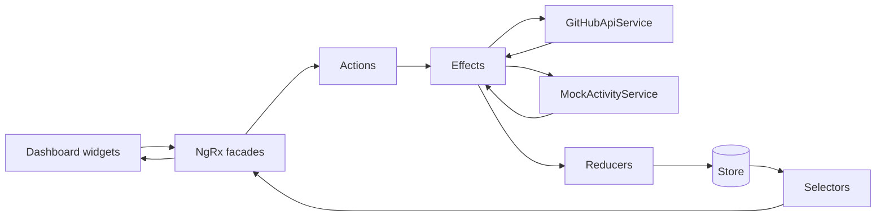

# DevBoard

DevBoard is a portfolio-grade Angular analytics dashboard that pulls live
repository telemetry from the GitHub public API and renders it through a
modular NgRx data pipeline.

## Stack

- Angular 17 standalone shell with lazy-loaded feature modules
- NgRx Store, Effects, Selectors, Facades, and Entity
- Angular CDK virtual scrolling
- Chart.js via `ng2-charts`
- Strict TypeScript
- Custom Webpack config for production code splitting and bundle analysis

## Running Locally

```bash
npm install
npm start
```

Open `http://127.0.0.1:4200/`.

Useful commands:

```bash
npm run build
npm run build:analyze
npm test -- --watch=false --browsers=ChromeHeadless
```

## Architecture

The app is intentionally split by responsibility:

- `src/app/core`: API models, GitHub API access, mock activity generation.
- `src/app/shared`: reserved for cross-feature UI primitives as the app grows.
- `src/app/features/dashboard`: lazy dashboard module, page shell, and widgets.
- `src/app/store`: root state plus feature slices for filters, preferences, and widgets.

Components stay thin. They render observable state from facades and dispatch user
intent back through those facades. Services are only called from NgRx effects.



## State Slices

- `filters`: shared date-range preset used by the chart, KPI, and table.
- `preferences`: dark/light theme state kept in NgRx, with no `localStorage`.
- `widgets`: repository KPI, activity points, loading/error states, and recent
  activity stored with NgRx Entity.

## Performance

Measured on local Chrome 149 through Playwright on July 10, 2026.

| Metric | Before | After |
| --- | ---: | ---: |
| Initial production JS | 583.51 kB | 403.30 kB |
| Initial estimated transfer | 168.69 kB | 113.07 kB |
| Dashboard/chart code | In initial bundle | Lazy chunks |
| 5,000-row table render benchmark | 82.26 ms | 8.08 ms |
| Table rows in live DOM | 5,000 | 10-14 |

Bundle figures come from `npm run build`. The table benchmark compares a full
5,000-row DOM insertion/layout pass against the CDK virtual-scroll viewport using
the same row shape.

Current production chunks:

- Initial total: `403.30 kB` raw, `113.07 kB` estimated transfer.
- `vendor-charts`: `196.23 kB` raw lazy chunk.
- Dashboard feature chunks: `24.97 kB` and `23.05 kB` raw lazy chunks.

## Notes

GitHub API rate limits can affect live calls. The table still receives a realistic
5,000-row mocked activity expansion so virtual scrolling can be evaluated reliably
without bypassing the NgRx data flow.
